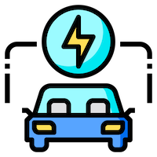

<div align="center" id="top"> 
  

&#xa0;

<a href="https://evhotels.onrender.com">Live Demo</a>

</div>

<h1 align="center">EV Friendly Hotels</h1>

<p align="center">
  

  

  

  

  

  

   
</p>

<h4 align="center"> 
	🚧  EV Friendly Hotels 🚀 Under development...  🚧
</h4>

<hr>

<p align="center">
  <a href="#dart-about">About</a> &#xa0; | &#xa0; 
  <a href="#sparkles-features">Features</a> &#xa0; | &#xa0;
  <a href="#rocket-technologies">Technologies</a> &#xa0; | &#xa0;
  <a href="#white_check_mark-requirements">Requirements</a> &#xa0; | &#xa0;
  <a href="#checkered_flag-starting">Starting</a> &#xa0; | &#xa0;
  <a href="#memo-license">License</a> &#xa0; | &#xa0;
  <a href="https://github.com/antoniorodr" target="_blank">Author</a>
</p>

<br>

## :dart: About

This project creates a database from data extracted from a map. The database can be accessed via the API or directly through the website's search functionality.

## :sparkles: Features

:heavy_check_mark: Find Hotels with EV Chargers\
:heavy_check_mark: Get access to all the data throught the API or direct in the website\
:heavy_check_mark: Free to use!

## :rocket: Technologies

The following tools were used in this project:

- [Flask Bootstrap](https://bootstrap-flask.readthedocs.io/en/stable/index.html)
- [Flask SQLAlchemy](https://flask-sqlalchemy.readthedocs.io/en/stable/quickstart/)
- [GeoPandas](https://geopandas.org/en/stable/getting_started/introduction.html)

## :white_check_mark: Requirements

There is no need to install anything to use the website or the API.

## :checkered_flag: Starting

```bash
# Clone this project
$ git clone https://github.com/antoniorodr/EV-Friendly-Hotels

# Access
$ cd EV-Friendly-Hotels

# Install dependences
$ pip install -r requirements.txt
```

## :memo: License

This project is under license from GNU. For more details, see the [LICENSE](LICENSE.md) file.

## :eyes: Do you like my work?

<a href="https://www.buymeacoffee.com/antoniorodr" target="_blank"></a>

Made with :heart: by <a href="https://github.com/antoniorodr" target="_blank">Antonio Rodriguez</a>

&#xa0;

<a href="#top">Back to top</a>
